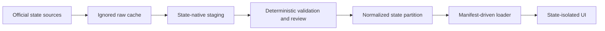

# Multi-State Data Architecture

## Decision

Use a shared normalized contract/item/bid model with state-native staging and manifest-driven presentation. Colorado is a supported state, not the baseline schema. Iowa is the second implementation and establishes the contract/project-number separation, effective-dated item catalog, bidder rank, alternate, and capability patterns required for future states.

## Boundaries

- Raw source: byte-for-byte downloaded or attached input; never app-loaded.
- Native staging: source-shaped rows that preserve fields and parser provenance.
- Normalized partition: reviewed relational rows consumed by the app.
- Materialized observation: exact agency-item evidence used by Matching Projects.

## Shared Contract

All states implement source, letting, contract, project-number, contract-item, agency-item, observation, and taxonomy tables. Bidder tables are enabled when the source provides bidder detail. State capabilities declare whether district filtering, engineer estimates, and bidder detail are available.

The app cannot infer state equivalence from an item code. `agency_item_id` is the lookup key. The same printed code in two agencies remains two identities.

## Native Extension Strategy

Do not add a shared column for every source-specific label. Use this order:

1. Map a concept to an existing shared field when semantics are equivalent.
2. Preserve source text in staging and provenance fields when it is presentation-only.
3. Add a normalized shared field when at least two sources need the concept or app behavior depends on it.
4. Add state-specific detail/export metadata only when the concept cannot be generalized without changing meaning.

Iowa examples:

- `SPEC` maps to versioned `spec_reference_code`.
- Call order, contract period, DBE goal, route, and letting status are shared contract metadata.
- Alternate set/member are shared contract-item metadata.
- Rank, percent of low, apparent low, and confirmed award are distinct bid fields.

## Search and Matching

Default evidence search is exact `agencyItemId` within one selected state. It does not join across project numbers and does not search another state partition.

Reviewed municipal mappings can promote municipal observations to a state item. Unreviewed description matches remain staging/review candidates. Keyword and canonical similarity are not part of the default evidence table.

State switching reloads the selected partition and resets item, filter, exclusion, sort-detail, and modal state. It cannot carry a raw item code into the next state.

## Presentation

The product title is **Roadway Cost Estimator**. The state manifest supplies agency names, taxonomy labels, source labels, prefix lengths, and capability flags.

The core table is stable across states. Optional fields are removed when unsupported rather than rendered as repeated empty values. State-specific contract and bidder fields remain available in detail and CSV export.

Saved Projects are state-bound. A state change selects or creates the Project for that state. A future multi-agency state can add reviewed evidence lines from more than one agency while retaining the Project's single state.

## Iowa Import Rules

Catalog:

- Fixed-width Item master text is primary.
- Attached PDF must have the identical 3,727-code set.
- PDF description, unit, and `SPEC` values validate/enrich the text rows.
- Iowa ERL sections drive taxonomy; 60/61/62 groups have explicit fallback labels.

Bid tabs:

- Parse by coordinates and contract state, not text-line splitting alone.
- Read printed bidder ranks for each one-to-three-column page group.
- Allow long currency values to extend into the nominal column gutter.
- Deduplicate repeated items by contract, section, line, and code.
- Preserve every contract item even when an alternate bidder price is blank.
- Preserve source page and raw locator on contract items and bidder prices.
- Match awarded vendor to exactly one bidder before promoting awarded prices.
- Derive one unweighted average unit price from valid bidder prices.
- Reconcile each bidder's item extensions to the reported bid total.

## Iowa Archive Refresh

Iowa is enabled because the June 16, 2026 pilot and the available 2024-present historical archive pass the committed validator and rendered UI checks. Archive ingestion is scripted from the official IDOT archive page. Each refresh must:

1. Refresh `data/staging/ia/bid_tab_archive.csv`.
2. Cache and hash raw PDFs under ignored `data/raw/ia/bid_tabs/`.
3. Add one source and one letting per parsed letting date.
4. Preserve one contract row per official contract ID per letting date.
5. Preserve one project-number row per printed project.
6. Reconcile bidder item totals to bidder totals, except source rounding or preserved unselected added-option rows.
7. Resolve awarded vendors uniquely before creating awarded evidence.
8. Keep unsupported engineer-estimate fields empty.

The official archive is [Iowa DOT Bid Tabulations](https://iowadot.gov/consultants-contractors/contracts/historical-completed-lettings/bid-tabulations). The catalog source is [Iowa DOT Bid Item Information](https://iowadot.gov/consultants-contractors/contracts/general-letting-information/bid-item-information), and taxonomy comes from the [Iowa Electronic Reference Library](https://ia.iowadot.gov/erl/current/GS/Navigation/nav.htm).

## Future State Checklist

- Define state/agency IDs and source provenance.
- Record catalog history and status behavior.
- Map the state's contract/project relationship.
- Identify bidder, alternate, award, and estimate capabilities.
- Create state-native staging and fixtures.
- Add manifest labels and capabilities.
- Validate code collisions, relationships, totals, and state isolation.
- Verify adaptive table, detail, export, and Project behavior before enabling the state.
